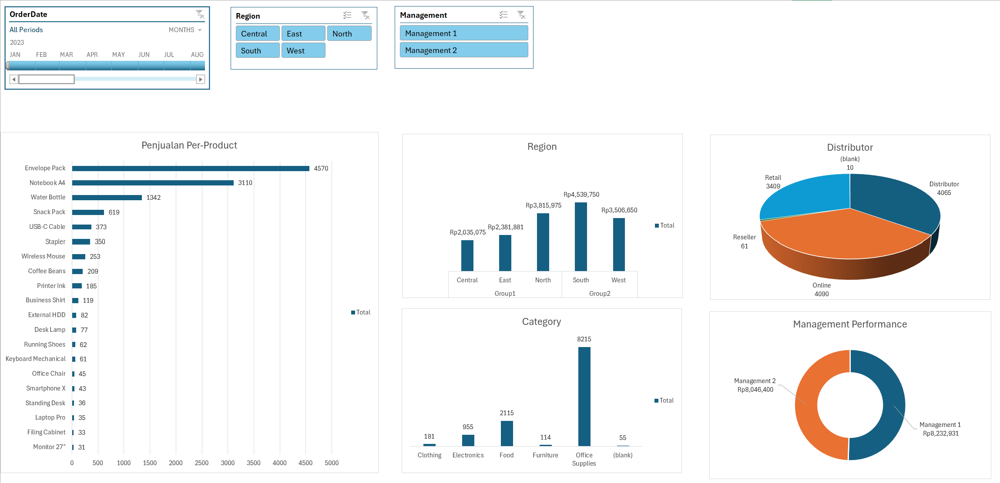

# 📚 About Data

This project analyzes regional sales data to understand product performance, regional revenue contributions, and distribution channel effectiveness.

The dataset contains comprehensive information formatted into an Excel workbook. The data encompasses details such as order dates, customer regions, product categories, unit pricing, sales channels, and total sales.

# 💡 Highlights

- The business generated a total revenue of over **Rp16.2 Million** across all operational regions in 2023.

- **South** and **North** regions are the primary revenue drivers, contributing **Rp4.5M** and **Rp3.8M** respectively to the total sales.

- **Office Supplies** and **Food** are the highest-performing categories in terms of volume, generating over 10,000 total items sold combined.

- **Envelope Pack** and **Notebook A4** are the most successful individual items, dominating the sales volume with 4,570 and 3,110 units sold.

- We evaluated the distribution channels, revealing that **Online** and **Distributor** channels are the most dominant, each handling over 4,000 transaction volumes.

- Analyzed management performance to ensure balanced operational oversight between Management 1 and Management 2.

# 🧹 Data Processing

Conducted data exploration, structuring, and aggregation entirely within Microsoft Excel before building the interactive dashboard:

- Transformed raw unformatted data ranges into dynamic **Excel Tables** to ensure automated updates when new data is added.

- Formulated and calculated the `Total Sales` metric by multiplying `Quantity` and `Unit Price`.

- Aggregated key business metrics using **Pivot Tables** to summarize revenue and volume across various dimensions (Region, Category, Product, and Sales Channel).

- Designed an interactive dashboard utilizing dynamic **Slicers** (Order Date, Region, and Management) to enable instant filtering and multi-dimensional analysis for stakeholders.

📍 **Excel File:** [Sales_Performance_Analysis.xlsx](link-ke-file-excel-anda)

📍 **Raw Data:** Included within the `From Range` sheet in the workbook.

# 📊 Visualization

Below is the interactive dashboard built in Microsoft Excel:

